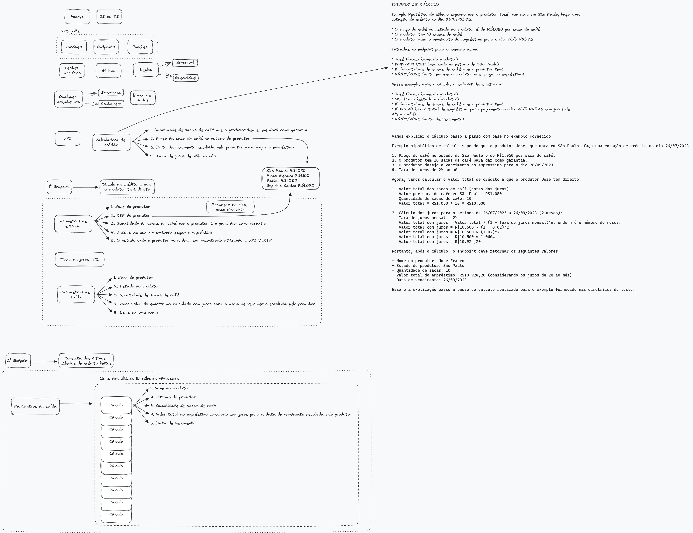
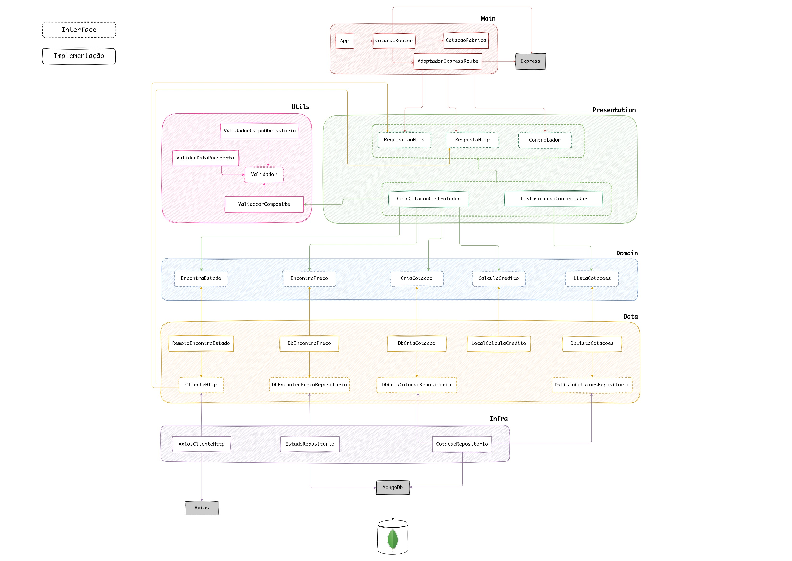
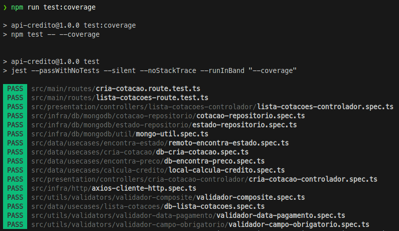
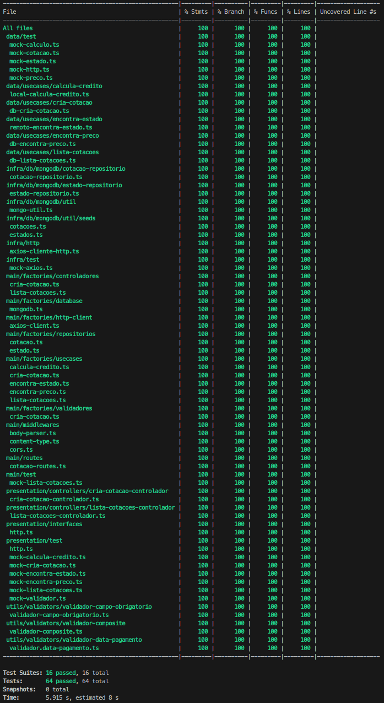

# Calculadora de Crédito para Empréstimo ao Produtor de Café

Este projeto é uma API que realiza o cálculo do valor de crédito disponível para produtores de café com base em diversos parâmetros, como quantidade de sacas, preço do café por estado, data de vencimento e taxa de juros.
A aplicação foi desenvolvida seguindo os princípios da Clean Architecture, TDD (Desenvolvimento Orientado por Testes) e DDD (Design Orientado por Domínio), visando alta desacoplagem, facilidade de manutenção e testabilidade dos componentes.

## Anotações sobre o desafio



## Tecnologias Utilizadas

- **Linguagem**: TypeScript
- **Testes Unitários**: Jest
- **Testes de Integração**: Supertest
- **Docker e docker compose**: Criação de ambiente de desenvolvimento e testes
- **MongoDB**: Banco de dados NoSQL utilizado para armazenar os dados do projeto

## Sobre a Arquitetura

A aplicação foi projetada seguindo os princípios da Clean Architecture, onde a separação de responsabilidades e a divisão em camadas visam tornar o código mais organizado e modular. A estruturação do projeto segue a hierarquia:

- **Domain**: Camada contendo as regras de negócio e entidades do domínio.
- **Data**: Camada responsável pela implementação dos casos de uso.
- **Presentation**: Camada responsável pela interação com o mundo exterior, recebendo as requisições HTTP e retornando as respostas adequadas.
- **Infra**: Camada responsável por integrar a aplicação com recursos externos, como banco de dados (**MongoDB**) e APIs ([ViaCep](https://viacep.com.br/)).
- **Main**: Camada responsável pela criação das factories e juntar todas as partes para que sejam executadas corretamente.



## Executando o Projeto localmente via Docker compose

> Certifique-se de ter **Docker** e **docker compose** instalados em sua máquina.

1. Clone este repositório: `git clone [URL do Repositório]`
2. Crie um arquivo `.env` (copie as variáveis do arquivo `.env.default`)

    ```bash
    VIA_CEP_API_URL=http://viacep.com.br/ws/
    TAXA_JUROS=0.02
    MONGO_URL=mongodb://localhost:27017/culttivo
    NOME_DATABASE=culttivo
    PORTA=8080
    ```

3. Inicie o projeto com docker-compose: `npm run docker:build`
4. Acesse a API em: `http://localhost:8080`

## Deploy

- **Aplicação**: Hospedada no site [Render](https://render.com), no seguinte endereço: `https://credito-api.onrender.com`.
  > Por ser um serviço gratuito, é possível que após um certo tempo de inatividade, a próxima requisição retorne um *timeout* pois o serviço estará reiniciando, mas após alguns segundos, deve voltar a funcionar normalmente.
- **Banco de Dados**: MongoDB, utilizando o serviço MongoDB Atlas para hospedagem.

## Endpoints

### 1. Criação de cotação

- **Endpoint**: `/api/cotacao`
- **Método**: `POST`

  ```bash
  curl --request POST \
  --url https://credito-api.onrender.com/api/cotacao \
  --header 'Content-Type: application/json' \
  --data '{
  "nome": "nome 1",
  "cep": "14414-899",
  "quantidade": 10,
  "dataPagamento": "2023-10-04"
  }'
  ```

- **Parâmetros de Entrada**:

  - Nome do produtor
  - CEP do produtor
  - Quantidade de sacas de café
  - Data de vencimento do empréstimo

  Exemplo:

  ```json
  {
    "nome": "nome 1",
    "cep": "12401-410",
    "quantidade": 10,
    "dataPagamento": "2023-10-04"
  }
  ```

- **Saída**:

  - Nome do produtor
  - Estado do produtor
  - Quantidade de sacas de café
  - Valor total do empréstimo calculado com juros para a data de vencimento escolhida
  - Data de vencimento

  Exemplo:

  ```json
  {
    "nome": "nome 1",
    "estado": "SP",
    "quantidade": 10,
    "valor": 10924.2,
    "dataVencimento": "2023-10-04"
  }
  ```

### 2. Listagem de Cotações

- **Endpoint**: `/api/cotacoes`
- **Método**: `GET`

  ```bash
  curl --request GET \
  --url https://credito-api.onrender.com/api/cotacoes \
  --header 'Content-Type: application/json'```

- **Saída**:

  - Lista dos 10 últimos cálculos efetuados, ordenados pela data de vencimento
  - Para cada cálculo:
    - Nome do produtor
    - Estado do produtor
    - Quantidade de sacas de café
    - Valor total do empréstimo calculado
    - Data de vencimento

  Exemplo:

  ```json
  [
    {
      "nome": "nome 2",
      "estado": "SP",
      "quantidade": 10,
      "valor": 10924.2,
      "dataVencimento": "2023-10-04"
    },
    {
      "nome": "nome 1",
      "estado": "MG",
      "quantidade": 30,
      "valor": 35720.26,
      "dataVencimento": "2023-12-23"
    }
  ]
  ```

## Testes

Foram aplicados testes unitários e de integração para garantir a qualidade do código e a funcionalidade correta da API. Os testes foram escritos seguindo a abordagem TDD, ou seja, primeiro os testes foram criados antes da implementação, o que resultou em um código mais robusto e confiável.

### Rodando os testes

> Antes, se certifique que as dependências foram instaladas com `npm install`

- Para rodar apenas os testes unitários: `npm run test:unit`
- Para rodar apenas os testes de integração: `npm run test:integration`
- Para rodar todos os testes: `npm test`
- Para rodar todos os testes e visualizar o relatório de cobertura: `npm run test:coverage`


